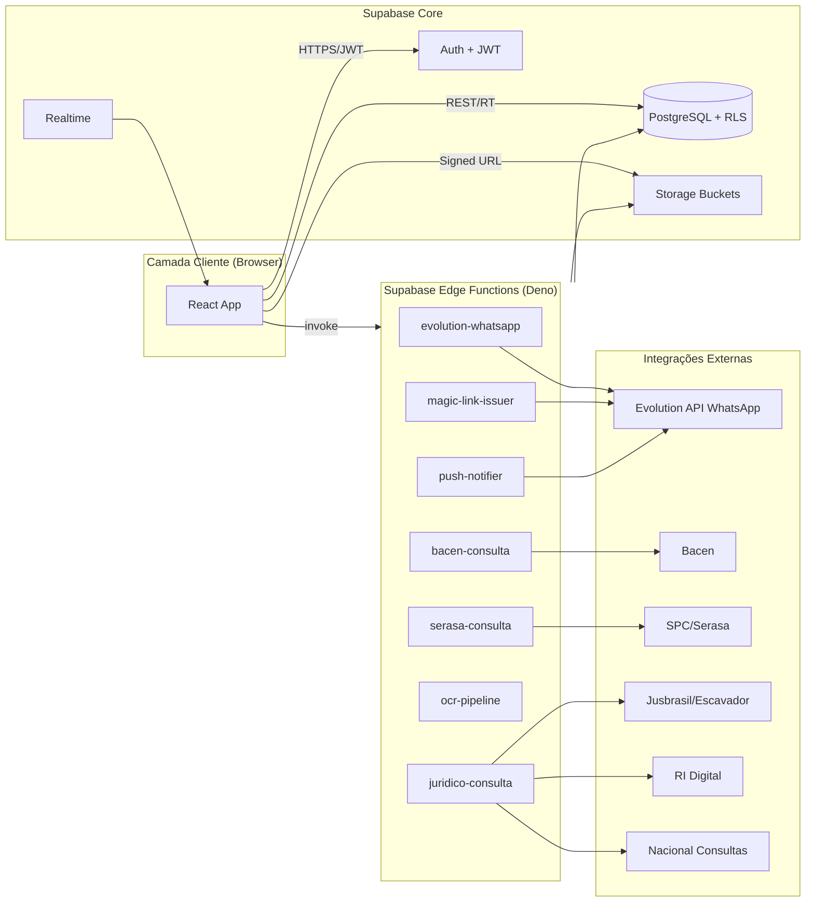
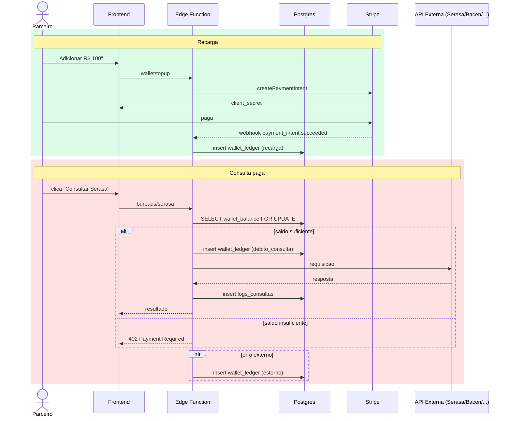

# 01 — Visão Geral & Arquitetura

## 1. Objetivo do produto

Plataforma web centralizada da **Mercurio Capital** para originação, esteira de análise e gestão de operações de crédito imobiliário (Home Equity, Crédito para Construção, Financiamento Imobiliário), com camada educacional (Universidade Mercurio), CRM de parceiros e portal do cliente.

## 2. Público & perfis de acesso

- **Admin** — operação interna Mercurio, acesso total.
- **Parceiro (Partner)** — originador externo; gerencia leads, propostas e equipe.
- **Assistente (Team Member)** — membro da equipe do parceiro, privilégios reduzidos (ver §02-roles-permissions).
- **Cliente (Lead autenticado)** — acompanha suas propostas e envia documentos.
- **Visitante público** — landing pública, login, registro, consulta por protocolo.

## 3. Stack técnica

### Frontend
- **React 18 + Vite + TypeScript**
- **React Router v6** (roteamento por perfil/guards).
- **TanStack Query** (cache de dados / estado de servidor).
- **Zustand** ou **Redux Toolkit** (estado de UI global, opcional).
- **Tailwind CSS** + **shadcn/ui** (design system).
- **Tremor** (gráficos analíticos) ou **Recharts**.
- **React Hook Form + Zod** (formulários e validação).
- **React Flow** (mapa visual de rede e fluxos do admin).
- **dnd-kit** (Kanbans).
- **i18n** com `react-i18next` (pt-BR base).
- **Tesseract.js** (OCR opcional para automação de uploads).
- **xlsx (SheetJS)** para exportação de relatórios.

### Backend / Plataforma
- **Supabase** como núcleo:
  - **PostgreSQL 15+** (modelo relacional + RLS).
  - **Supabase Auth** (e-mail/senha, magic link, 2FA TOTP).
  - **Supabase Storage** (buckets segmentados por tipo: `documentos-parceiros` privado, `documentos-propostas` privado, `consulta-publica-protocolo` público com restrição via signed URL/policy).
  - **Edge Functions (Deno)**: integração Evolution API (WhatsApp), webhooks Bacen, SPC/Serasa, Jusbrasil/Escavador, geração de magic links customizados, push notifications, OCR pipeline.
  - **Realtime** para Kanbans e notificações.
- **Node.js (opcional, serviços auxiliares)**: workers de fila, geração de PDFs (contratos), assinatura digital.
- **Redis** (cache leve; opcional, fase 2).

### Infra & DevOps
- **Vercel** (frontend) + **Supabase Cloud** (backend).
- **GitHub Actions** (CI/CD, lint, typecheck, testes).
- **Sentry** (observabilidade frontend e edge).
- **PostHog** ou **Mixpanel** (analytics produto).
- **Bitwarden / Doppler** (segredos).

## 4. Diagrama macro



## 5. Princípios de arquitetura

1. **RLS-first**: toda regra de acesso a dado vive em policies do Postgres; o frontend nunca é fonte de autoridade.
2. **Edge para integrações**: nenhum segredo de API externa toca o navegador; chamadas externas saem **somente** de Edge Functions.
3. **Magic Link seguro**: tokens únicos, com expiração curta (≤ 30 min), single-use, persistidos com hash (`pgcrypto`).
4. **Bucket público controlado**: a "consulta por protocolo" usa Edge Function que valida protocolo + rate limit antes de gerar `signedUrl` curta — **nunca** expor diretamente o bucket privado.
5. **Auditoria completa**: tabela `audit_log` com triggers em entidades sensíveis (propostas, documentos, status).
6. **Separação por domínio** no front: `modules/auth`, `modules/propostas`, `modules/equipes`, `modules/universidade`, `modules/admin`.
7. **Feature flags**: tabela `feature_flags` por perfil/usuário para liberar gradualmente.

## 6. Camadas lógicas do frontend

```
src/
├── app/              # bootstrap, providers, router
├── modules/
│   ├── auth/         # login, registro, magic-link, 2fa
│   ├── public/       # landing, consulta por protocolo
│   ├── partner/      # dashboard, propostas, simulações, equipe
│   ├── client/       # portal do cliente (lead)
│   ├── admin/        # gestão completa, react-flow, kanbans
│   └── universidade/ # LMS
├── shared/
│   ├── components/   # ui (shadcn), layout
│   ├── hooks/
│   ├── lib/          # supabase client, query client, utils
│   ├── services/     # wrappers de chamadas (DB, Edge)
│   └── types/        # tipos gerados do schema
└── routes/           # definição central de rotas + guards
```

## 7. Camadas lógicas do backend (Supabase)

```
supabase/
├── migrations/       # SQL versionado
├── functions/        # edge functions (Deno)
│   ├── evolution-whatsapp/
│   ├── magic-link-issuer/
│   ├── bacen-consulta/
│   ├── serasa-consulta/
│   ├── juridico-consulta/
│   ├── ocr-pipeline/
│   └── push-notifier/
├── policies/         # RLS reutilizáveis (documentadas)
└── seeds/            # dados iniciais (status, produtos, perfis)
```

## 8. Decisões confirmadas

| Tema | Escolha |
|---|---|
| Assinatura eletrônica de contratos | **Clicksign** |
| Push notifications | **FCM (Firebase Cloud Messaging)** direto |
| Vídeo da Universidade | **Vimeo** |
| Pagamento de assinaturas + recargas de carteira | **Stripe** |
| Mobile | **PWA agora**; React Native em fase posterior, após estabilizar tabelas |

## 9. Carteira do parceiro (wallet) — visão arquitetural

Motivação: cada consulta a bureaus externos (Bacen, SPC/Serasa, Jusbrasil, Escavador, RI Digital, Nacional Consultas) tem **custo**. O parceiro precisa **adicionar saldo** dentro do sistema (via Stripe) para executar consultas. Sem saldo, a Edge Function bloqueia a chamada antes de tocar a API externa.

- **Conta-carteira por parceiro** (`partner_wallets`): saldo em centavos, moeda BRL, versão otimista.
- **Ledger imutável** (`wallet_ledger`): toda mutação de saldo (recarga, débito de consulta, estorno, ajuste admin) gera uma entrada append-only com `saldo_antes`, `saldo_depois`, `referencia`.
- **Pré-autorização**: a Edge consulta `wallet_balance(partner_id) >= preco_consulta` em transação `SERIALIZABLE`; se ok, faz `INSERT` no ledger com `tipo='debito_consulta'` **antes** de chamar a API externa.
- **Falha externa**: se a chamada externa falhar (timeout/5xx), a Edge gera `tipo='estorno'` no mesmo `correlation_id`.
- **Recarga**: parceiro escolhe valor → cria `payment_intents` no Stripe → webhook confirma → entra `tipo='recarga'` no ledger.
- **Tabela de preços**: `precos_consulta` indexada por `tipo_consulta` e versão (mantém histórico).
- **Admin**: pode aplicar `tipo='ajuste_credito'` ou `'ajuste_debito'` com motivo (auditado).
- **Cota dura** opcional por parceiro/dia (`partner_wallets.limite_diario_centavos`).

Fluxo macro:



Detalhes de tabelas em [04-database-schema.md §13](./04-database-schema.md#13-carteira-do-parceiro-wallet) e fluxo completo em [07-integrations-flows.md](./07-integrations-flows.md).
