# 10 — Blueprint Visual Completo (Mermaid)

> Visão consolidada antes da geração do SQL. Cada diagrama foca em uma camada do sistema, do mais alto nível ao detalhe.

---

## 1. Visão macro — todos os atores e camadas

```mermaid
flowchart TB
  classDef public fill:#fef3c7,stroke:#d97706,color:#000
  classDef client fill:#dbeafe,stroke:#2563eb,color:#000
  classDef partner fill:#dcfce7,stroke:#16a34a,color:#000
  classDef admin fill:#fee2e2,stroke:#dc2626,color:#000
  classDef edge fill:#ede9fe,stroke:#7c3aed,color:#000
  classDef db fill:#f1f5f9,stroke:#475569,color:#000
  classDef ext fill:#fce7f3,stroke:#be185d,color:#000

  V((Visitante)):::public
  C((Cliente / Lead)):::client
  P((Parceiro)):::partner
  TM((Assistente)):::partner
  A((Admin Mercurio)):::admin

  subgraph FE[Frontend - React SPA]
    direction TB
    LP[Landing / Login / Registro]:::public
    PROTO[Consulta por Protocolo]:::public
    CLI[Portal Cliente /c/*]:::client
    PAR[Painel Parceiro /p/*]:::partner
    ADM[Painel Admin /admin/*]:::admin
  end

  subgraph EDGE[Supabase Edge Functions]
    direction TB
    EAUTH[magic-link issuer/consumer]:::edge
    EWPP[whatsapp evolution]:::edge
    EBUR[bureaus credito/juridico]:::edge
    EOCR[OCR pipeline]:::edge
    ECTR[contratos generator]:::edge
    EPUSH[push notifier]:::edge
    EREP[relatorios xlsx]:::edge
  end

  subgraph CORE[Supabase Core]
    direction TB
    AUTH[(Auth + JWT)]:::db
    DB[(PostgreSQL + RLS)]:::db
    RT[(Realtime)]:::db
    STO[(Storage Buckets)]:::db
  end

  subgraph EXT[Integracoes Externas]
    direction TB
    EVO[Evolution API WhatsApp]:::ext
    BAC[Bacen]:::ext
    SER[SPC/Serasa]:::ext
    JUS[Jusbrasil/Escavador]:::ext
    RIDIG[RI Digital]:::ext
    NAC[Nacional Consultas]:::ext
    SIGN[D4Sign/Clicksign]:::ext
    PAY[Stripe/Asaas]:::ext
    FCM[FCM Push]:::ext
  end

  V --> LP
  V --> PROTO
  C --> CLI
  P --> PAR
  TM --> PAR
  A --> ADM

  LP --> AUTH
  PROTO --> EAUTH
  CLI --> AUTH
  PAR --> AUTH
  ADM --> AUTH

  CLI --> DB
  PAR --> DB
  ADM --> DB
  CLI --> STO
  PAR --> STO
  ADM --> STO
  RT --> CLI
  RT --> PAR
  RT --> ADM

  CLI --> EAUTH
  PAR --> EAUTH
  PAR --> EBUR
  ADM --> EBUR
  PAR --> EOCR
  ADM --> ECTR
  ADM --> EREP
  PROTO --> EAUTH

  EAUTH --> DB
  EWPP --> DB
  EBUR --> DB
  EOCR --> DB
  ECTR --> DB
  EPUSH --> DB
  EREP --> DB

  EAUTH --> EVO
  EWPP --> EVO
  EBUR --> BAC
  EBUR --> SER
  EBUR --> JUS
  EBUR --> RIDIG
  EBUR --> NAC
  ECTR --> SIGN
  EPUSH --> EVO
  EPUSH --> FCM
  CLI -.assinatura.-> PAY
```

---

## 2. Sitemap completo (todas as rotas)

```mermaid
flowchart TB
  classDef pub fill:#fef3c7,stroke:#d97706
  classDef cli fill:#dbeafe,stroke:#2563eb
  classDef par fill:#dcfce7,stroke:#16a34a
  classDef adm fill:#fee2e2,stroke:#dc2626

  ROOT(("/"))

  subgraph PUB[Publicas]
    direction TB
    R0["/"]:::pub
    R1["/login"]:::pub
    R2["/registro"]:::pub
    R2b["/registro/sucesso"]:::pub
    R3["/recuperar-senha"]:::pub
    R3b["/recuperar-senha/confirmar"]:::pub
    R4["/protocolo"]:::pub
    R4b["/protocolo/:numero"]:::pub
    R5["/magic/:token"]:::pub
    R6["/2fa"]:::pub
  end

  subgraph CLIENTE[Cliente /c]
    direction TB
    C0["/c"]:::cli
    C1["/c/propostas"]:::cli
    C2["/c/propostas/:id"]:::cli
    C3["/c/propostas/:id/documentos"]:::cli
    C4["/c/perfil"]:::cli
    C5["/c/notificacoes"]:::cli
    C6["/c/universidade"]:::cli
  end

  subgraph PARC[Parceiro /p]
    direction TB
    P0["/p"]:::par
    P1["/p/dashboard"]:::par
    P2["/p/simulacoes"]:::par
    P2b["/p/simulacoes/nova"]:::par
    P3["/p/propostas"]:::par
    P3b["/p/propostas/nova"]:::par
    P3c["/p/propostas/:id"]:::par
    P3d["...tabs: proponentes, imoveis, documentos, historico, kanban"]:::par
    P4["/p/equipe"]:::par
    P4b["/p/equipe/convidar"]:::par
    P5["/p/relatorios"]:::par
    P6["/p/universidade"]:::par
    P6b["/p/universidade/curso/:slug"]:::par
    P6c["/p/universidade/certificados"]:::par
    P7["/p/perfil"]:::par
    P8["/p/configuracoes"]:::par
  end

  subgraph ADM[Admin /admin]
    direction TB
    A0["/admin"]:::adm
    A1["/admin/dashboard"]:::adm
    A1b["/admin/dashboard/funil"]:::adm
    A1c["/admin/dashboard/gargalos"]:::adm
    A2["/admin/parceiros"]:::adm
    A2b["/admin/parceiros/aprovacoes"]:::adm
    A2c["/admin/parceiros/:id"]:::adm
    A3["/admin/clientes"]:::adm
    A3b["/admin/clientes/:id"]:::adm
    A4["/admin/propostas"]:::adm
    A4b["/admin/propostas/:id"]:::adm
    A4c["/admin/propostas/kanban"]:::adm
    A5["/admin/rede ReactFlow"]:::adm
    A6["/admin/documentos"]:::adm
    A6b["/admin/documentos/pendentes"]:::adm
    A7["/admin/financeiro"]:::adm
    A7b["/admin/financeiro/contratos"]:::adm
    A8["/admin/relatorios"]:::adm
    A9["/admin/universidade"]:::adm
    A9b["/admin/universidade/cursos"]:::adm
    A9c["/admin/universidade/cursos/:id"]:::adm
    A9d["/admin/universidade/assinaturas"]:::adm
    A10["/admin/fluxos"]:::adm
    A10b["/admin/fluxos/:id"]:::adm
    A11["/admin/campanhas"]:::adm
    A12["/admin/integracoes"]:::adm
    A13["/admin/configuracoes"]:::adm
    A14["/admin/auditoria"]:::adm
    A15["/admin/usuarios"]:::adm
  end

  ROOT --> PUB
  R1 --> CLIENTE
  R1 --> PARC
  R1 --> ADM
  R5 --> CLIENTE
  R5 --> PARC
```

---

## 3. RBAC — papéis, escopos e capacidades

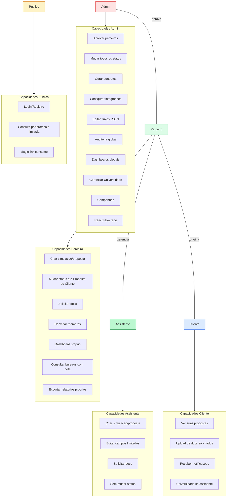

---

## 4. Modelo entidade-relacionamento (completo)

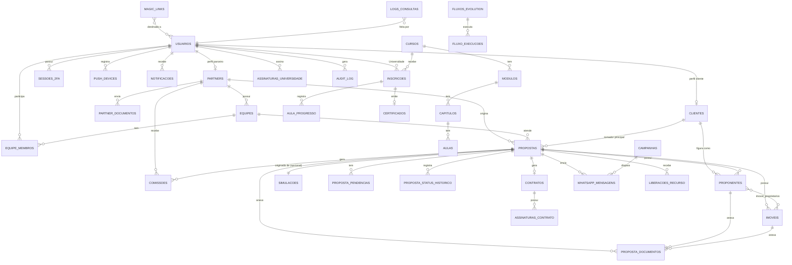

---

## 5. Domínios e suas tabelas (mapa visual)

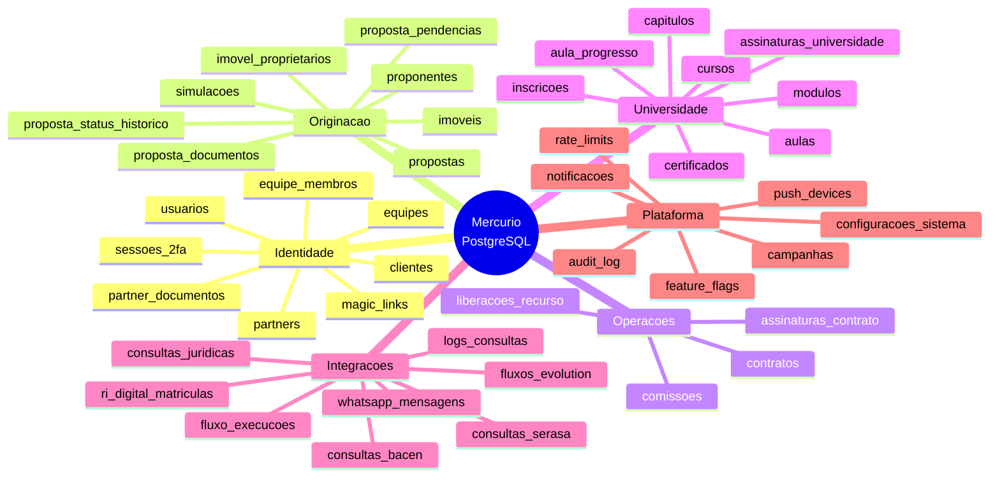

---

## 6. Jornada completa — registro do parceiro até liberacao do recurso

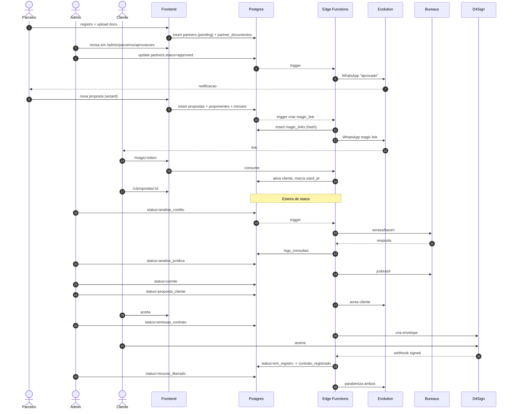

---

## 7. State machine — esteira da proposta

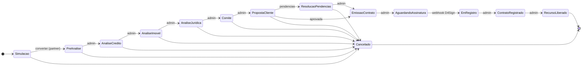

---

## 8. Wizard de criacao de proposta (UX detalhada)

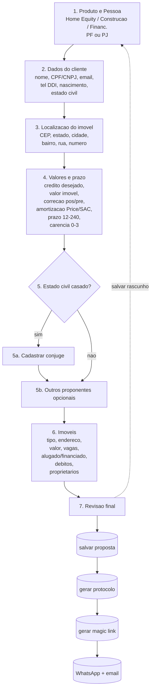

---

## 9. Detalhe da proposta (tabs e dados)

```mermaid
flowchart LR
  subgraph TABS[/p/propostas/:id]
    T1[Resumo]
    T2[Proponentes]
    T3[Imoveis]
    T4[Documentos]
    T5[Historico]
    T6[Kanban]
  end

  T1 --> R1[Tag PF/PJ]
  T1 --> R2[Cliente, valor solicitado, valor imoveis]
  T1 --> R3[Prazo, juros 1.39%+IPCA, carencia]
  T1 --> R4[Tabela Price calculada]
  T1 --> R5[Produto: Home Equity / Construcao / Financiamento]
  T1 --> R6[Dados vendedor se Financiamento]

  T2 --> P1[Lista proponentes]
  T2 --> P2[Adicionar conjuge/socio]
  T2 --> P3[Vincular como proprietario]

  T3 --> I1[Lista imoveis]
  T3 --> I2[Adicionar imovel + busca CEP]
  T3 --> I3[Caracteristicas + vagas + valor BRL]
  T3 --> I4[Alugado/Financiado/Debitos]
  T3 --> I5[Toggle endereco do proponente]

  T4 --> D1[PF / PJ / Imovel]
  T4 --> D2[Upload + validacao]
  T4 --> D3[Solicitar ao cliente]
  T4 --> D4[OCR opcional]

  T5 --> H1[proposta_status_historico]
  T5 --> H2[whatsapp_mensagens]
  T5 --> H3[audit_log filtrado]

  T6 --> K1[Cartao por status]
  T6 --> K2[Drag-drop respeitando RBAC]
```

---

## 10. Storage — buckets, conteudo e politicas

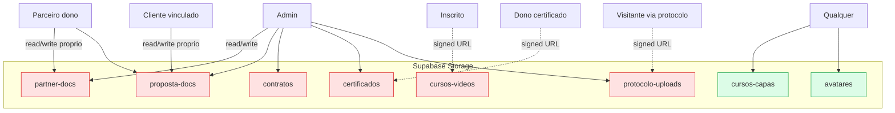

---

## 11. Edge Functions — catalogo e gatilhos

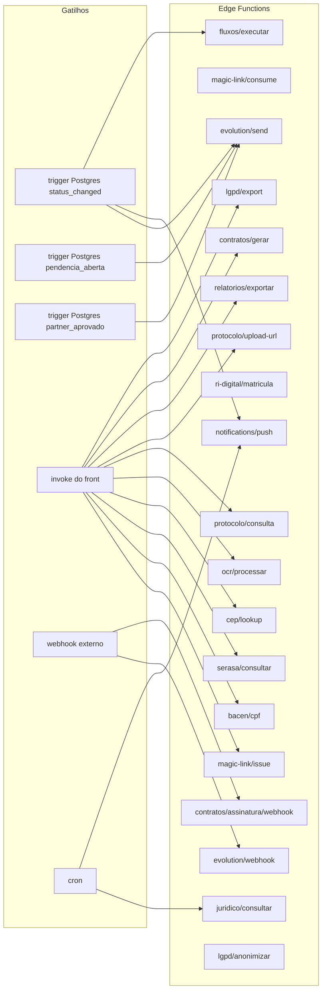

---

## 12. Magic link — ciclo de vida

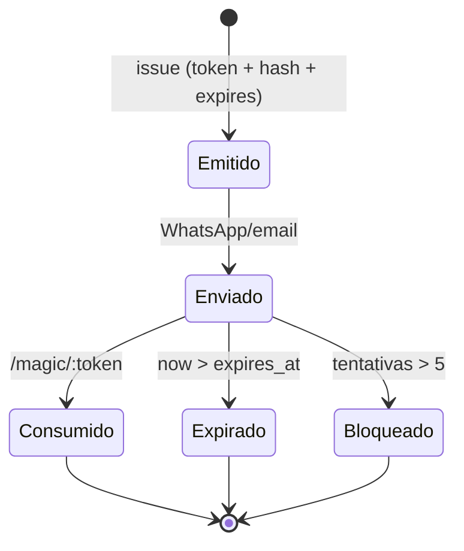

---

## 13. Consulta publica por protocolo (zero PII)

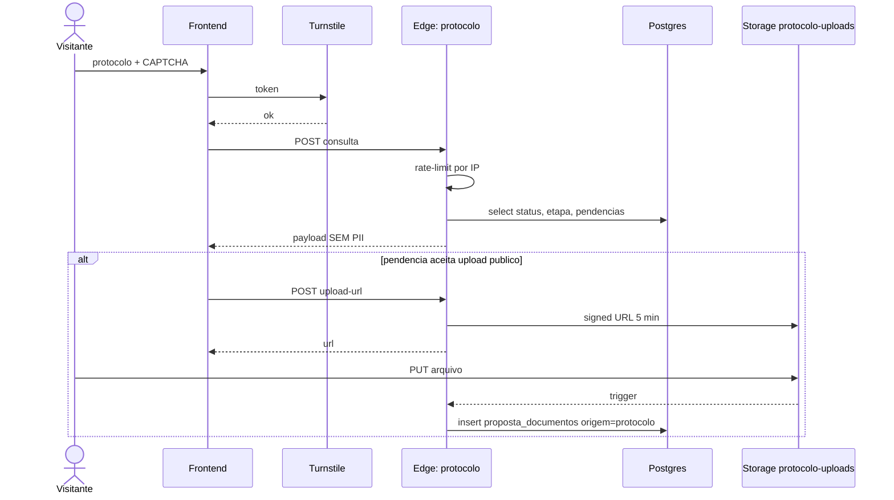

---

## 14. RLS — modelo de aplicacao

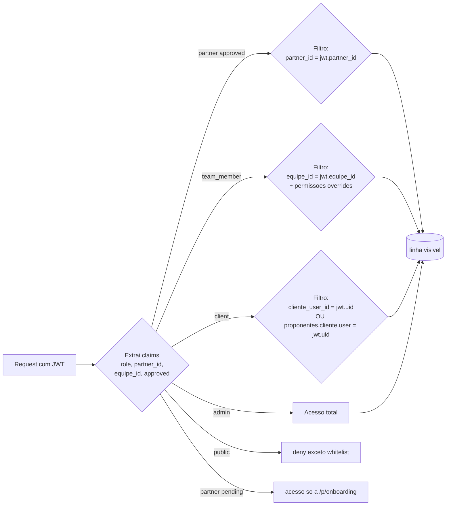

---

## 15. Universidade Mercurio — hierarquia e progresso

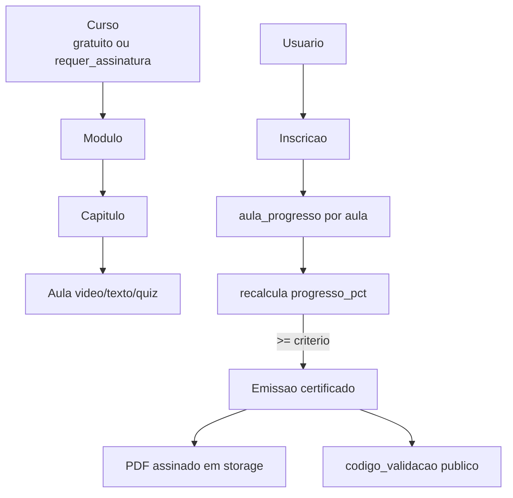

---

## 16. Fluxos Evolution (JSON) e execucao

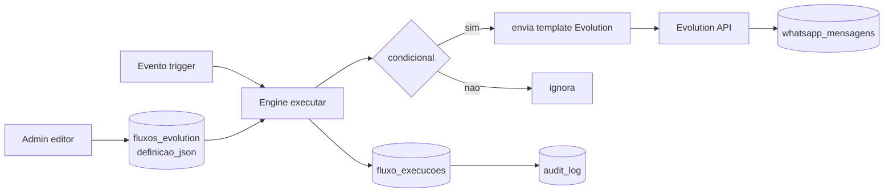

---

## 17. Notificacoes (multi-canal)

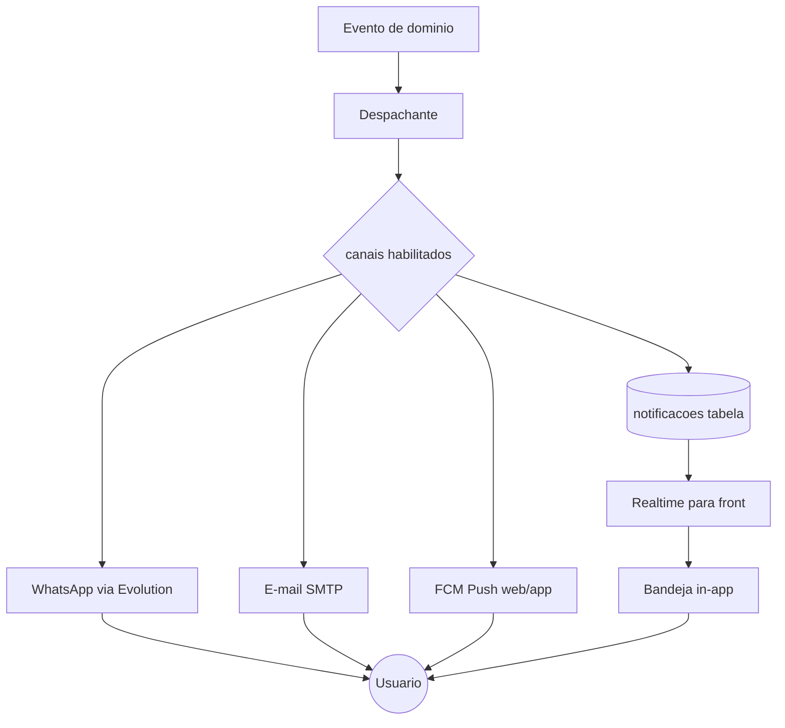

---

## 18. React Flow — rede de originacao (admin)

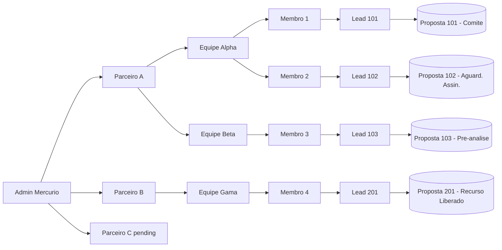

---

## 19. Dashboards — composicao de KPIs

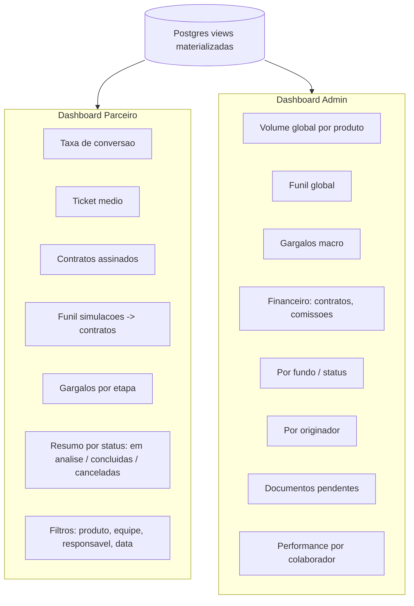

---

## 20. Carteira do parceiro \u2014 modelo l\u00f3gico

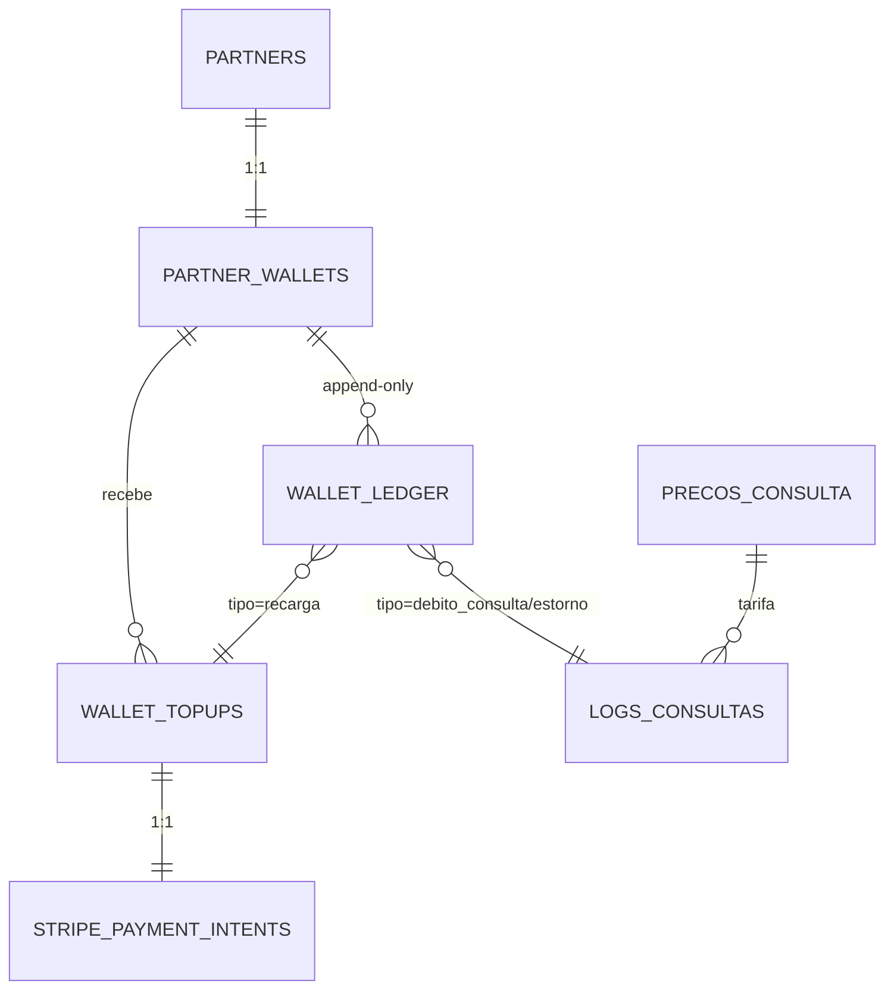

## 21. Recarga e d\u00e9bito \u2014 fluxos detalhados

```mermaid
sequenceDiagram
  autonumber
  actor PA as Parceiro
  participant FE as Frontend
  participant EF as Edge: wallet/topup
  participant ST as Stripe
  participant WH as Edge: stripe/webhook
  participant DB as Postgres

  rect rgb(220,252,231)
  Note over PA,DB: Recarga
  PA->>FE: escolhe valor (ex R$ 100)
  FE->>EF: POST {valor}
  EF->>ST: createPaymentIntent
  ST-->>EF: pi_xxx + client_secret
  EF->>DB: insert wallet_topups (status=requires_payment_method)
  EF->>DB: insert stripe_payment_intents
  EF-->>FE: client_secret
  PA->>ST: paga via Elements
  ST-->>WH: evt payment_intent.succeeded
  WH->>DB: insert stripe_webhooks_inbox (idempotente)
  WH->>DB: select wallet_credit('recarga', valor, ...)
  WH->>DB: update wallet_topups.status=succeeded + ledger_id
  WH-->>PA: push + email "saldo atualizado"
  end
```

```mermaid
sequenceDiagram
  autonumber
  actor PA as Parceiro
  participant FE as Frontend
  participant EF as Edge: bureaus/serasa
  participant DB as Postgres
  participant EXT as Serasa

  PA->>FE: clica "Consultar Serasa"
  FE->>EF: POST {cpf, proposta_id}
  EF->>DB: SELECT preco_centavos FROM precos_consulta WHERE tipo='serasa_pf' AND vigente_ate IS NULL
  EF->>DB: BEGIN; SET TRANSACTION SERIALIZABLE
  EF->>DB: SELECT wallet_debit(partner_id,'debito_consulta',preco,...)
  alt saldo_insuficiente
    DB-->>EF: exception
    EF-->>FE: 402 {erro, preco, saldo}
    FE-->>PA: "Saldo insuficiente. Recarregar"
  else saldo ok
    DB-->>EF: ledger_entry
    EF->>EXT: requisicao
    alt sucesso
      EXT-->>EF: payload
      EF->>DB: insert logs_consultas (ledger_id)
      EF->>DB: COMMIT
      EF-->>FE: resultado
    else erro externo
      EXT-->>EF: 5xx
      EF->>DB: SELECT wallet_credit('estorno',preco,correlation_id)
      EF->>DB: COMMIT
      EF-->>FE: 502 com aviso de estorno
    end
  end
```

## 22. State machine \u2014 entrada do ledger

```mermaid
stateDiagram-v2
  [*] --> recarga: payment_intent.succeeded
  [*] --> debito_consulta: wallet_debit ok
  [*] --> ajuste_credito: admin manual
  [*] --> ajuste_debito: admin manual
  debito_consulta --> estorno: erro externo (mesmo correlation_id)
  recarga --> [*]
  estorno --> [*]
  ajuste_credito --> [*]
  ajuste_debito --> [*]
```

## 23. Resumo dos artefatos a serem gerados (pr\u00f3ximos passos)

```mermaid
flowchart LR
  M[Mapas Mermaid OK] --> SQL[Migrations SQL<br/>schema + enums + tabelas]
  SQL --> RLS[Policies RLS<br/>por papel e tabela]
  RLS --> TRG[Triggers + funcoes<br/>status, audit, totais]
  TRG --> EF[Edge Functions skeletons<br/>magic-link, evolution, bureaus]
  EF --> SEEDS[Seeds<br/>configuracoes, fluxos, curso inicial]
  SEEDS --> FE[Front bootstrap<br/>routes, layouts, guards]
  FE --> ITER[Iteracao por modulo<br/>M1 -> M12]
```
