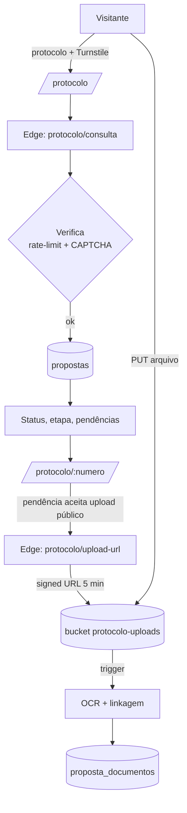
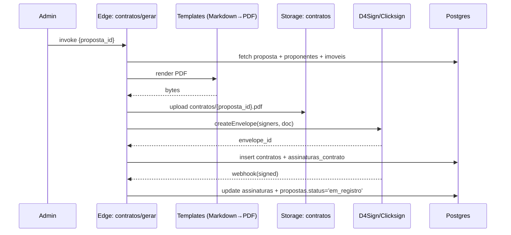

# 07 — Integrações & Fluxos Operacionais

## 1. Evolution API (WhatsApp)

### Capacidades usadas
- Envio de templates aprovados (texto + botões).
- Recebimento de webhooks (entrega, leitura, resposta).
- Mensagens com mídia (PDFs, imagens) — opcional fase 2.

### Padrão de fluxo (Edge Function)
1. Trigger no Postgres (mudança de status, criação de pendência, novo magic link, aprovação de parceiro).
2. Pgnet/HTTP chama edge `evolution-whatsapp` com payload `{evento, entidade_id}`.
3. Edge consulta `fluxos_evolution` ativo para o evento, monta mensagem com template, dispara para Evolution.
4. Persiste em `whatsapp_mensagens` com `evolution_message_id`.
5. Webhook `evolution/webhook` atualiza status (`enviado → entregue → lido`).

### Eventos mapeados (catálogo inicial)
| Evento | Destinatário | Template |
|---|---|---|
| `partner.status.approved` | Parceiro | "Cadastro aprovado, acesse {{link}}" |
| `partner.status.rejected` | Parceiro | "Cadastro rejeitado: {{motivo}}" |
| `partner.documento.solicitado` | Parceiro | "Documento {{tipo}} pendente" |
| `proposta.criada` | Cliente | Magic link de ativação |
| `proposta.status.changed` | Cliente + Parceiro | "Proposta {{protocolo}} agora em {{status}}" |
| `proposta.pendencia.aberta` | Cliente | Link curto para upload |
| `proposta.pendencia.resolvida` | Parceiro | Confirmação |
| `contrato.assinatura.solicitada` | Cliente | Link D4Sign |
| `contrato.registrado` | Cliente + Parceiro | Conclusão |
| `equipe.membro.convidado` | Membro | Magic link de aceite |
| `campanha.disparada` | Lista | Personalizada |

### E-mail transacional (Resend)

- `proposta.criada`: `admin_create_proposta` e `partner_create_proposta` enfileiram `proposta_cliente_magic_link_v1` em `email_outbox` quando o cliente possui e-mail.
- `proposta.status.changed`: o histórico de status enfileira `proposta_status_changed_v1`, com idempotência por item de `proposta_status_historico`.
- `equipe.membro.convidado`: `partner_invite_membro` enfileira `convite_equipe_v1`.
- O enqueue é best-effort e não bloqueia criação/transição. O worker `email-dispatcher` envia via Resend e marca `enviado` ou `erro` com detalhe.
- O job Supabase Cron `email-dispatcher-every-5-minutes` usa `pg_cron + pg_net` para invocar o worker a cada 5 minutos. A chamada HTTP manual permanece disponível para contingência.
- O admin gerencia os registros existentes em `templates_mensagem` por `/admin/templates`, com filtro por canal e preview HTML em iframe sandbox (scripts bloqueados).
- Testes controlados usam a RPC admin-only `admin_email_template_test_enqueue`, gravam `evento=template_teste` e `origem=admin_templates` na outbox e aguardam o dispatcher.

## 2. Magic Link — fluxo seguro

```mermaid
sequenceDiagram
  participant API as Edge: magic-link/issue
  participant DB as Postgres
  participant EVO as Evolution
  participant Cli as Cliente
  participant App as Frontend
  participant Auth as Supabase Auth

  API->>API: gera token aleatório 32B
  API->>DB: insert magic_links(token_hash, expires_at, payload)
  API->>EVO: envia mensagem com URL /magic/:token
  Cli->>App: clica
  App->>API: POST /magic-link/consume {token}
  API->>DB: select where token_hash, used_at IS NULL, now() < expires_at
  API->>DB: update used_at = now()
  API->>Auth: createUser ou signInWithJWT customizado
  API-->>App: session JWT
  App-->>Cli: redirect (cliente: /c/propostas/:id; partner: /p; membro: /p)
```

**Segurança**:
- Token em URL; armazenado **só como hash** (`encode(digest(token,'sha256'),'hex')`).
- TTL ≤ 30 min, single-use (`used_at`).
- Limite 5 emissões por destinatário/24h.
- Após consumo: revogação imediata; auditoria gravada.
- Links públicos usam `https://mercuriocapitalsa.com.br`; `SITE_URL`/`APP_URL` podem sobrescrever por ambiente, mas o fallback de produção nunca é localhost.

## 3. Consulta pública por protocolo (sem auth)



Regras de exposição (público): `{protocolo, status, etapa, atualizado_em, pendencias[descricao]}`. **Nunca**: CPF, valor, nome, telefone, contrato.

## 4. Esteira de Status — gatilhos automáticos

| Status alvo | Disparos automáticos |
|---|---|
| `pre_analise` | WhatsApp ao cliente (boas-vindas) + push parceiro |
| `analise_credito` | Edge: `serasa/consultar` (assíncrono); push admin |
| `analise_imovel` | Edge: `ri-digital/matricula`; push admin |
| `analise_juridica` | Edge: `juridico/consultar`; push admin |
| `comite` | Notificação interna |
| `proposta_cliente` | WhatsApp + e-mail ao cliente |
| `resolucao_pendencias` | Cria pendências e dispara templates |
| `emissao_contrato` | Edge: `contratos/gerar` |
| `aguardando_assinatura` | Edge: D4Sign envelope |
| `em_registro` | Webhook D4Sign |
| `contrato_registrado` | Edge: comissões |
| `recurso_liberado` | WhatsApp + e-mail celebrativo |

## 5. Geração de contrato



## 6. OCR Pipeline (Tesseract.js)

- Acionado em insert de `proposta_documentos` quando `mime_type` ∈ {pdf, jpg, png}.
- Extrai texto, salva em `ocr_texto`.
- Match heurístico: detecta CPF, CNPJ, RG, valor, endereço → preenche campos faltantes em `proponentes`/`imoveis` quando vazios.
- Confirmação humana sempre obrigatória antes de gravar em campo crítico.

## 7. Push notifications (Web/App)

- Frontend registra Service Worker, obtém token FCM, envia para edge `notifications/push/register` → `push_devices`.
- Edge `push-notifier` envia notificação ao usuário em eventos catalogados.
- Bandeja in-app via tabela `notificacoes` com Realtime (`subscribe` em `notificacoes`).

## 8. Calendário de jobs/cron

| Job | Frequência | Ação |
|---|---|---|
| `expire_magic_links` | a cada 10 min | marca expirados |
| `recalcula_dashboards` | a cada hora | views materializadas |
| `gera_relatorios_diarios` | 06:00 BRT | snapshot por parceiro |
| `cobranca_pendencias` | 09:00 BRT | reenvio WhatsApp para pendências > 24h |
| `monitor_processos_juridicos` | diário | webhook Jusbrasil |
| `recalcula_progresso_universidade` | horário | progresso/certificados |

## 9. Fluxos JSON (Evolution) — exemplo

```jsonc
{
  "id": "fluxo.cliente.status_changed",
  "evento": "proposta.status.changed",
  "publico": "cliente",
  "passos": [
    { "tipo": "condicao", "se": "status == 'proposta_cliente'", "entao": ["enviar_template_proposta_aceite"] },
    { "tipo": "enviar_template", "template": "status_generico", "vars": ["protocolo","status"] },
    { "tipo": "aguardar_resposta", "timeout_min": 60, "fallback": "enviar_lembrete" }
  ]
}
```
