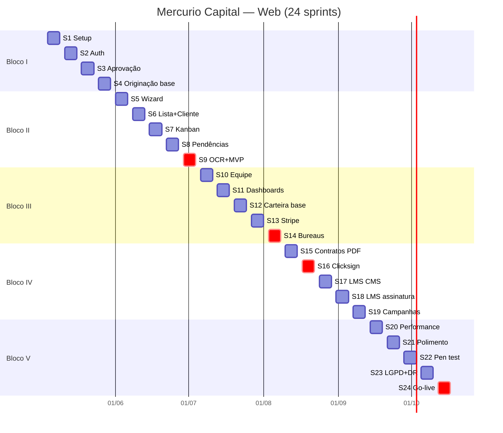
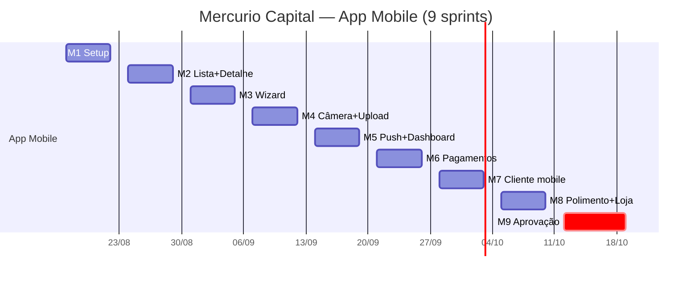

# 11 — Proposta de Desenvolvimento (Sprints & Prazos)

> Documento-base para a proposta comercial de desenvolvimento do **Mercurio Capital**, derivado do [09-roadmap.md](../09-roadmap.md).
> Ordem das entregas segue dependências técnicas reais (origem → contrato → financeiro → polimento).

## Premissas

| Item | Valor |
|---|---|
| **Time** | 4 devs (1 fullstack senior · 1 fullstack pleno · 1 front pleno · 1 mobile pleno) |
| **Modelo de sprint** | Sprints de **1 semana** (segunda → sexta) |
| **Capacidade** | ~140 h úteis / sprint (web, Devs 1-3) + ~35 h / sprint (mobile, Dev 4 a partir de M1) |
| **Início previsto** | Semana de **04/05/2026** (Sprint 1 web) · **17/08/2026** (Sprint M1 mobile) |
| **Escopo** | Fases 0 → 11 (MVP completo + hardening) + App iOS/Android |
| **Stack** | Vite + React + TS + Tailwind + Supabase + Stripe + Clicksign · React Native + Expo |
| **Cerimônias** | Daily 15min · Planning seg · Review/Retro sex · Refinamento qua |
| **Entregas** | Deploy contínuo em **staging** a cada merge; **prod** ao fim de cada fase |
| **Copilot** | GitHub Copilot Pro+ para todos os 4 devs (US$ 39/dev/mês) |

**Padrão de cada sprint**: planning (segunda) → execução → demo + retro (sexta) → release notes em `CHANGELOG.md`.

---

## Composição do time & carga horária

| # | Perfil | Projeto | Sprints ativas | h/sprint¹ | Total horas |
|---|---|---|---|---|---|
| Dev 1 | Fullstack Senior (Tech Lead) | Web | 1 → 24 (24 sprints) | 35h | 840h |
| Dev 2 | Fullstack Pleno | Web | 1 → 24 (24 sprints) | 35h | 840h |
| Dev 3 | Front Pleno | Web | 1 → 24 (24 sprints) | 35h | 840h |
| Dev 4 | Mobile Pleno | Mobile | M1 → M9 (9 sprints) | 35h | 315h |
| **Total** | | | | | **2.835h** |

¹ 40h/semana − 5h de cerimônias = 35h de entrega por dev por sprint.

**Distribuição de responsabilidades**:

| Área | Dev 1 (FSS) | Dev 2 (FSP) | Dev 3 (Front) | Dev 4 (Mobile) |
|---|---|---|---|---|
| Arquitetura & banco | ✅ lead | ✅ | — | — |
| Edge Functions / API | ✅ lead | ✅ | — | — |
| RLS / segurança | ✅ lead | ✅ | — | — |
| Telas web (UI) | ✅ revisão | ✅ | ✅ lead | — |
| Componentes / design system | — | ✅ | ✅ lead | — |
| Integrações externas | ✅ lead | ✅ | — | — |
| CI/CD & infra | ✅ lead | ✅ | — | — |
| App React Native | — | — | — | ✅ lead |

---

## Estimativa de custos

> Valores de referência para contratação **PJ**. Câmbio USD/BRL: **R$ 5,80**.
> Ajustar conforme modelo de contratação (CLT, PJ, squad alocado).

### Custo de desenvolvimento (mão de obra)

| Dev | Perfil | Taxa/h | h/sprint | Sprints | Total horas | Custo total |
|---|---|---|---|---|---|---|
| Dev 1 | Fullstack Senior (Tech Lead) | R$ 160 | 35h | 24 | 840h | **R$ 134.400** |
| Dev 2 | Fullstack Pleno | R$ 110 | 35h | 24 | 840h | **R$ 92.400** |
| Dev 3 | Front Pleno | R$ 95 | 35h | 24 | 840h | **R$ 79.800** |
| Dev 4 | Mobile Pleno | R$ 110 | 35h | 9 | 315h | **R$ 34.650** |
| **Subtotal dev** | | | | | **2.835h** | **R$ 341.250** |

### GitHub Copilot Pro+

> US$ 39,00/dev/mês · plano Individual Pro+ (cobrado em USD no cartão).

| Dev | Meses ativos | US$/mês | R$/mês | Total |
|---|---|---|---|---|
| Dev 1 — FSS | 6 meses (mai → out) | US$ 39 | R$ 226 | R$ 1.356 |
| Dev 2 — FSP | 6 meses (mai → out) | US$ 39 | R$ 226 | R$ 1.356 |
| Dev 3 — Front | 6 meses (mai → out) | US$ 39 | R$ 226 | R$ 1.356 |
| Dev 4 — Mobile | 3 meses (ago → out) | US$ 39 | R$ 226 | R$ 678 |
| **Subtotal Copilot** | | | | **R$ 4.746** |

### Infraestrutura (custo do cliente)

> Itens abaixo são responsabilidade do cliente e não entram no custo da proposta de dev.

| Serviço | Plano sugerido | US$/mês | Duração | Total USD |
|---|---|---|---|---|
| Vercel | Pro | US$ 20 | 6 meses | US$ 120 |
| Supabase | Pro | US$ 25 | 6 meses | US$ 150 |
| Sentry | Team | US$ 26 | 6 meses | US$ 156 |
| PostHog | Hobby/Scale | US$ 0–50 | 6 meses | US$ 0–300 |
| Expo EAS Build | Production | US$ 99 | 3 meses (mobile) | US$ 297 |
| Apple Developer Program | — | US$ 99/ano | 1 ano | US$ 99 |
| Google Play Developer | — | US$ 25 (único) | — | US$ 25 |
| **Total infra (ref.)** | | | | **~US$ 850–1.150** |

### Resumo financeiro

| Item | Valor |
|---|---|
| Mão de obra web (Devs 1-3) | R$ 306.600 |
| Mão de obra mobile (Dev 4) | R$ 34.650 |
| GitHub Copilot Pro+ (4 devs) | R$ 4.746 |
| **Total proposta de desenvolvimento** | **R$ 346.000** |
| Infraestrutura (cliente) | ~R$ 5.000–7.000 |
| **Investimento total estimado** | **~R$ 351.000–353.000** |

> ⚠️ Valores não incluem taxas de terceiros (Stripe, Clicksign, bureaus, WhatsApp Business API).
> Sugere-se adicionar **10% de reserva de contingência** para eventuais mudanças de escopo.

---

## Roadmap por Sprint — Plataforma Web

### Bloco I — Fundações & Onboarding (Sprints 1 a 4)

#### **Sprint 1** — Setup técnico (Fase 0)
**Período**: 04/05 → 08/05/2026
- [ ] Provisionamento Supabase (local, staging, prod) + variáveis de ambiente
- [ ] Bootstrap Vite + React + TS + Tailwind + shadcn + React Router + TanStack Query
- [ ] CI/CD (GitHub Actions): lint, typecheck, build, deploy Vercel
- [ ] Esqueleto de migrações + Edge Functions (Deno)
- [ ] Sentry + PostHog conectados
- [ ] Storybook/Ladle com tokens de design

**Entregável**: ambiente reproduzível, deploy automático em staging a cada push em `main`.

#### **Sprint 2** — Auth & Onboarding (Fase 1, parte 1)
**Período**: 11/05 → 15/05/2026
- [ ] Migrações: `usuarios`, `partners`, `partner_documentos`, `magic_links`, `sessoes_2fa`, `audit_log`
- [ ] RLS base + helpers `auth.is_admin()`, `auth.partner_id()`
- [ ] Telas: `/registro`, `/login`, `/recuperar-senha`, `/2fa`
- [ ] Edge `magic-link/issue` + `magic-link/consume`

**Entregável**: parceiro consegue se registrar e autenticar com 2FA.

#### **Sprint 3** — Aprovação de parceiros (Fase 1, parte 2)
**Período**: 18/05 → 22/05/2026
- [ ] Modal de upload de documentos do parceiro (S3 + signed URL)
- [ ] Tela `/admin/parceiros/aprovacoes` (listar, aprovar, recusar, ver docs)
- [ ] Edge `evolution-whatsapp` (envio simples + retry)
- [ ] Notificação ao parceiro quando aprovado/recusado

**Entregável**: ciclo completo de onboarding até aprovação manual pelo admin.

#### **Sprint 4** — Originação base (Fase 2, parte 1)
**Período**: 25/05 → 29/05/2026
- [ ] Migrações: `simulacoes`, `propostas`, `proponentes`, `imoveis`, `imovel_proprietarios`, `proposta_status_historico`, `proposta_pendencias`, `proposta_documentos`
- [ ] RLS + triggers de transição de status
- [ ] Calculadora Price (componente reutilizável + testes unitários)

**Entregável**: modelo de dados pronto e validado por testes.

---

### Bloco II — Originação & Esteira (Sprints 5 a 9)

#### **Sprint 5** — Wizard de proposta (Fase 2, parte 2)
**Período**: 01/06 → 05/06/2026
- [ ] Wizard `/p/propostas/nova` (7 etapas) com persistência incremental
- [ ] Geração de protocolo + magic link cliente

#### **Sprint 6** — Lista, detalhe e portal cliente (Fase 2, parte 3)
**Período**: 08/06 → 12/06/2026
- [ ] Lista `/p/propostas` com filtros e busca
- [ ] Detalhe `/p/propostas/:id` com tabs (Resumo, Proponentes, Imóveis, Documentos, Histórico)
- [ ] Portal cliente: `/c`, `/c/propostas`, `/c/propostas/:id`, upload de documentos

**Entregável**: parceiro cria proposta → cliente recebe magic link → envia documentos.

#### **Sprint 7** — Kanban & Realtime (Fase 3, parte 1)
**Período**: 15/06 → 19/06/2026
- [ ] Kanban global e por proposta (dnd-kit + Supabase Realtime)
- [ ] Tela admin de propostas e detalhe
- [ ] Notificações in-app (Realtime) + bandeja

#### **Sprint 8** — Pendências & consulta pública (Fase 3, parte 2)
**Período**: 22/06 → 26/06/2026
- [ ] Pendências e ciclo de resolução
- [ ] Consulta pública por protocolo (CAPTCHA Turnstile + rate-limit)
- [ ] Upload via protocolo (signed URLs)

#### **Sprint 9** — OCR & polimento esteira (Fase 3, parte 3)
**Período**: 29/06 → 03/07/2026
- [ ] OCR pipeline (extração de campos de RG, CPF, comprovantes)
- [ ] Refinamento de UX da esteira
- [ ] **Demo de fechamento do MVP de originação**

**Marco**: 🎯 **MVP de originação ponta a ponta em produção**.

---

### Bloco III — Equipes, Carteira & Bureaus (Sprints 10 a 14)

#### **Sprint 10** — Equipe & convites (Fase 4, parte 1)
**Período**: 06/07 → 10/07/2026
- [ ] Migrações `equipes`, `equipe_membros`
- [ ] Convites por magic link
- [ ] Telas de gestão de equipe

#### **Sprint 11** — Dashboards (Fase 4, parte 2)
**Período**: 13/07 → 17/07/2026
- [ ] Dashboard parceiro (Tremor/Recharts): KPIs, funil, gargalos
- [ ] Filtros por responsável, equipe, produto, data
- [ ] Edge `relatorios/exportar` (xlsx)
- [ ] Dashboard admin global

#### **Sprint 12** — Carteira do parceiro — base (Fase 5, parte 1)
**Período**: 20/07 → 24/07/2026
- [ ] Migrações `partner_wallets`, `wallet_ledger`, `precos_consulta`, `wallet_topups`, `stripe_payment_intents`, `stripe_webhooks_inbox`
- [ ] Funções `wallet_debit` / `wallet_credit` (SECURITY DEFINER, SERIALIZABLE)
- [ ] Trigger de criação automática da carteira ao inserir parceiro
- [ ] Seed de `precos_consulta`

#### **Sprint 13** — Stripe & telas de carteira (Fase 5, parte 2)
**Período**: 27/07 → 31/07/2026
- [ ] Edge `wallet/topup`, `wallet/balance`, `wallet/extrato`, `stripe/webhook`, `wallet/ajuste`
- [ ] Telas parceiro: `/p/carteira`, `/p/carteira/recarga` (Stripe Elements), `/p/carteira/extrato`
- [ ] Telas admin: `/admin/financeiro/carteiras`, `/admin/financeiro/precos`, `/admin/financeiro/recargas`
- [ ] Notificações: saldo baixo, recarga, bloqueio

**Marco**: 🎯 **Carteira operacional + Stripe em produção**.

#### **Sprint 14** — Integrações pagas (Fase 6)
**Período**: 03/08 → 07/08/2026
- [ ] Edges `bacen-consulta`, `serasa-consulta`, `juridico-consulta`, `ri-digital-matricula`, `nacional-consultas`
- [ ] Cada Edge debita carteira via `wallet_debit` antes da chamada externa; estorno em falha
- [ ] HTTP 402 padronizado para saldo insuficiente
- [ ] Botões "Consultar (R$ X,XX)" no detalhe da proposta
- [ ] Logs em `logs_consultas` + webhook Jusbrasil

---

### Bloco IV — Contratos, LMS & Comunicação (Sprints 15 a 19)

#### **Sprint 15** — Contratos & PDF (Fase 7, parte 1)
**Período**: 10/08 → 14/08/2026
- [ ] Migrações `contratos`, `assinaturas_contrato`, `liberacoes_recurso`, `comissoes`
- [ ] Geração de PDF de contrato (template renderer)

#### **Sprint 16** — Clicksign & comissões (Fase 7, parte 2)
**Período**: 17/08 → 21/08/2026
- [ ] Integração Clicksign (envio + webhook)
- [ ] Atualização automática de status (`em_registro`, `contrato_registrado`, `recurso_liberado`)
- [ ] Cálculo e visualização de comissões
- [ ] Dashboard financeiro admin

**Marco**: 🎯 **Ciclo completo: proposta → contrato → liberação de recurso**.

#### **Sprint 17** — Universidade — CMS & player (Fase 8, parte 1)
**Período**: 24/08 → 28/08/2026
- [ ] Migrações `cursos`, `modulos`, `capitulos`, `aulas`, `inscricoes`, `aula_progresso`, `certificados`, `assinaturas_universidade`
- [ ] CMS admin de cursos (módulos, capítulos, aulas)
- [ ] Player de vídeo + tracking de progresso

#### **Sprint 18** — Universidade — assinatura & certificados (Fase 8, parte 2)
**Período**: 31/08 → 04/09/2026
- [ ] Emissão automática de certificados (PDF)
- [ ] Integração Stripe para assinatura
- [ ] Gating por assinatura

#### **Sprint 19** — Fluxos & campanhas (Fase 9)
**Período**: 07/09 → 11/09/2026
- [ ] Editor visual de fluxos JSON (`fluxos_evolution`, `fluxo_execucoes`)
- [ ] Catálogo de templates aprovados
- [ ] `campanhas` com agendamento
- [ ] Push web (FCM)

---

### Bloco V — Analytics, Hardening & Go-Live (Sprints 20 a 24)

#### **Sprint 20** — Network map & performance (Fase 10, parte 1)
**Período**: 14/09 → 18/09/2026
- [ ] `/admin/rede` com React Flow
- [ ] Views materializadas para dashboards pesados
- [ ] Code splitting + lazy routes + Suspense

#### **Sprint 21** — Polimento & onboarding (Fase 10, parte 2)
**Período**: 21/09 → 25/09/2026
- [ ] Feature flags em produção
- [ ] Tour onboarding (parceiro)
- [ ] Acessibilidade (WCAG AA)

#### **Sprint 22** — Segurança (Fase 11, parte 1)
**Período**: 28/09 → 02/10/2026
- [ ] Pen test interno (OWASP)
- [ ] Mascaramento de PII em logs
- [ ] Correções de vulnerabilidades

#### **Sprint 23** — LGPD & DR (Fase 11, parte 2)
**Período**: 05/10 → 09/10/2026
- [ ] Política LGPD: exportação e anonimização
- [ ] Documentação operacional (runbooks)
- [ ] Plano de DR (PITR + restore drill)

#### **Sprint 24** — Go-live & estabilização
**Período**: 12/10 → 16/10/2026
- [ ] Cutover staging → produção definitiva
- [ ] Treinamento da equipe operacional
- [ ] Monitoramento ativo + bug-fix da primeira semana
- [ ] Handover técnico

**Marco**: 🚀 **Plataforma Mercurio Capital em produção**.

---

## Cronograma Macro

| Bloco | Sprints | Período | Marco |
|---|---|---|---|
| I — Fundações & Onboarding | 1 → 4 | 04/05 → 29/05/2026 | Onboarding de parceiros |
| II — Originação & Esteira | 5 → 9 | 01/06 → 03/07/2026 | 🎯 MVP originação |
| III — Equipes, Carteira, Bureaus | 10 → 14 | 06/07 → 07/08/2026 | 🎯 Carteira + bureaus |
| IV — Contratos, LMS, Comunicação | 15 → 19 | 10/08 → 11/09/2026 | 🎯 Ciclo completo |
| V — Analytics, Hardening, Go-live | 20 → 24 | 14/09 → 16/10/2026 | 🚀 Go-live |

**Duração total**: 24 sprints × 1 semana = **~5,5 meses** (04/05/2026 → 16/10/2026).

---

## Diagrama de fases

---

## Riscos & dependências externas

| Risco | Mitigação |
|---|---|
| Aprovação demorada de templates WhatsApp Business | Iniciar processo na Sprint 1 |
| Onboarding Stripe + Clicksign (KYC) | Iniciar na Sprint 1 (paralelo) |
| Contratos com bureaus (Serasa, Bacen, Jusbrasil) | Iniciar negociação até Sprint 8 |
| Indisponibilidade de APIs externas em staging | Mockar via MSW + ambiente de teste dedicado |
| Mudança de escopo durante execução | Backlog separado + repriorização em planning |

---

## Pressupostos para a proposta comercial

- Cliente disponibiliza **product owner** com decisão em até 24h
- Acessos a serviços externos (Stripe, Clicksign, Evolution, bureaus) provisionados pelo cliente
- Infraestrutura: Vercel (front) + Supabase Cloud (back) custeados pelo cliente
- Suporte pós-go-live: contrato separado (sugestão: 30 dias de bug-fix incluso na Sprint 24)

---

# Anexo A — Proposta separada: App Mobile (iOS + Android)

> Projeto **complementar e independente** ao web. Pode rodar em paralelo a partir da Sprint 8 (após estabilização da API), ou sequencial após a Sprint 24.

## Premissas

| Item | Valor |
|---|---|
| **Stack** | React Native + Expo (managed) → entregas iOS + Android com 1 codebase |
| **Time** | Dev 4 — Mobile Pleno (já contabilizado no time de 4 devs) |
| **Sprint** | 1 semana (alinhado ao calendário web) |
| **Distribuição** | TestFlight (iOS) + Internal App Sharing (Android) durante dev; lojas no fim |
| **Backend** | Reaproveita API Supabase existente (sem retrabalho de back) |
| **Push** | Expo Notifications + FCM/APNs |
| **Auth** | OAuth + magic link reaproveitando o web |
| **Copilot** | GitHub Copilot Pro+ (3 meses, ago → out · US$ 39/mês = R$ 678, já incluso na tabela de custos) |

## Escopo (público-alvo: parceiro + cliente)

**Parceiro mobile** (prioridade 1 — operação em campo):
- Login + 2FA biométrico
- Dashboard simplificado (KPIs principais)
- Lista de propostas + filtros
- Detalhe da proposta + tabs
- **Wizard de criação de proposta** (otimizado para mobile)
- Upload de documentos com câmera + scan automático (vision OCR)
- Notificações push (status mudou, nova pendência, saldo baixo)
- Carteira (saldo + extrato + recarga via Apple Pay / Google Pay)

**Cliente mobile** (prioridade 2):
- Acesso via magic link / login
- Acompanhamento de proposta (timeline visual)
- Upload de documentos com câmera
- Chat / suporte (WhatsApp deep-link)

## Sprints — App Mobile

### **Sprint M1** — Setup & autenticação
- [ ] Bootstrap Expo + EAS + TS + NativeWind
- [ ] Navegação (expo-router)
- [ ] Tela de login + magic link + biometria (Face ID / Touch ID)
- [ ] Configuração TestFlight + Internal Track
- [ ] CI/CD (EAS Build automático)

### **Sprint M2** — Lista & detalhe de propostas
- [ ] Conexão com API Supabase
- [ ] Lista de propostas com pull-to-refresh + filtros
- [ ] Detalhe com tabs (Resumo, Proponentes, Imóveis, Documentos, Histórico)
- [ ] Cache offline (TanStack Query persist)

### **Sprint M3** — Wizard mobile
- [ ] Wizard de criação adaptado a mobile (steps + validação por etapa)
- [ ] Persistência local (rascunho)
- [ ] Integração com calculadora Price

### **Sprint M4** — Câmera & upload
- [ ] Captura de documentos via câmera (expo-camera)
- [ ] Scan automático (recorte e melhora de imagem)
- [ ] Upload com signed URL + retry em background
- [ ] OCR no servidor (reutiliza pipeline web)

### **Sprint M5** — Push & dashboards
- [ ] Expo Notifications + FCM/APNs
- [ ] Tela de notificações in-app
- [ ] Dashboard parceiro mobile (KPIs principais)
- [ ] Carteira mobile (saldo + extrato)

### **Sprint M6** — Pagamentos in-app
- [ ] Recarga via Apple Pay / Google Pay (Stripe Mobile SDK)
- [ ] Tela de extrato com filtros
- [ ] Notificações de saldo baixo

### **Sprint M7** — Cliente mobile
- [ ] Fluxo de login do cliente (magic link via deep-link)
- [ ] Acompanhamento de proposta (timeline)
- [ ] Upload de documentos com câmera
- [ ] Chat / suporte

### **Sprint M8** — Polimento & loja
- [ ] Acessibilidade + dark mode
- [ ] Empty states + estados de erro
- [ ] Ícones, splash screens, telas das lojas
- [ ] Submissão **App Store** + **Google Play**
- [ ] Testes em devices reais (iOS 16+, Android 11+)

### **Sprint M9** — Aprovação nas lojas & go-live
- [ ] Iteração com revisores (App Store Review + Play)
- [ ] Correções pós-review
- [ ] Lançamento gradual (rollout 10% → 100%)
- [ ] Monitoramento (Sentry + Firebase Crashlytics)

**Duração mobile**: 9 sprints × 1 semana = **~2 meses** + tempo de aprovação nas lojas (5 a 10 dias úteis adicionais).

## Diagrama mobile

> **Observação**: as datas acima assumem **paralelismo com o web a partir da Sprint 17**. Pode ser deslocado conforme decisão comercial.

## Custos adicionais — mobile

| Item | Quem paga | Quando |
|---|---|---|
| Apple Developer Program | Cliente | Sprint M1 (US$ 99/ano) |
| Google Play Developer | Cliente | Sprint M1 (US$ 25 único) |
| EAS Build (Expo) | Cliente | Sprint M1 (plano Production) |
| Stripe Mobile SDK | — | Sem custo adicional além das taxas Stripe |
| Sentry mobile + Crashlytics | Cliente | Sprint M1 |

## Riscos específicos — mobile

| Risco | Mitigação |
|---|---|
| Reprovação na App Store por política | Seguir guidelines + revisão prévia interna |
| Tempo de review imprevisível | Iniciar build de produção 2 sprints antes do go-live |
| Fragmentação Android | Testar em devices low-end (Android 11) desde a Sprint M2 |
| Push token expirado | Renovação automática + fallback para in-app |

---

## Resumo executivo

| Projeto | Devs | Taxa ref. | Sprints | Horas | Custo dev | Início | Fim |
|---|---|---|---|---|---|---|---|
| **Plataforma Web** | Dev 1, 2, 3 | R$ 95–160/h | 24 × 1sem | 2.520h | R$ 306.600 | 04/05/2026 | 16/10/2026 |
| **App Mobile** | Dev 4 | R$ 110/h | 9 × 1sem | 315h | R$ 34.650 | 17/08/2026 | 16/10/2026* |
| **GitHub Copilot Pro+** | 4 devs | US$ 39/dev/mês | — | — | R$ 4.746 | 04/05/2026 | 16/10/2026 |
| **Total** | **4 devs** | | **33 sprints** | **2.835h** | **R$ 346.000** | | |

*sujeito a aprovação nas lojas (+5 a 10 dias).

**Marcos comerciais sugeridos**:
1. Fim do Bloco II (03/07/2026) — pagamento de marco MVP
2. Fim do Bloco III (07/08/2026) — pagamento marco financeiro
3. Fim do Bloco IV (11/09/2026) — pagamento marco contratos
4. Go-live web (16/10/2026) — pagamento final web
5. Aprovação nas lojas — pagamento final mobile
