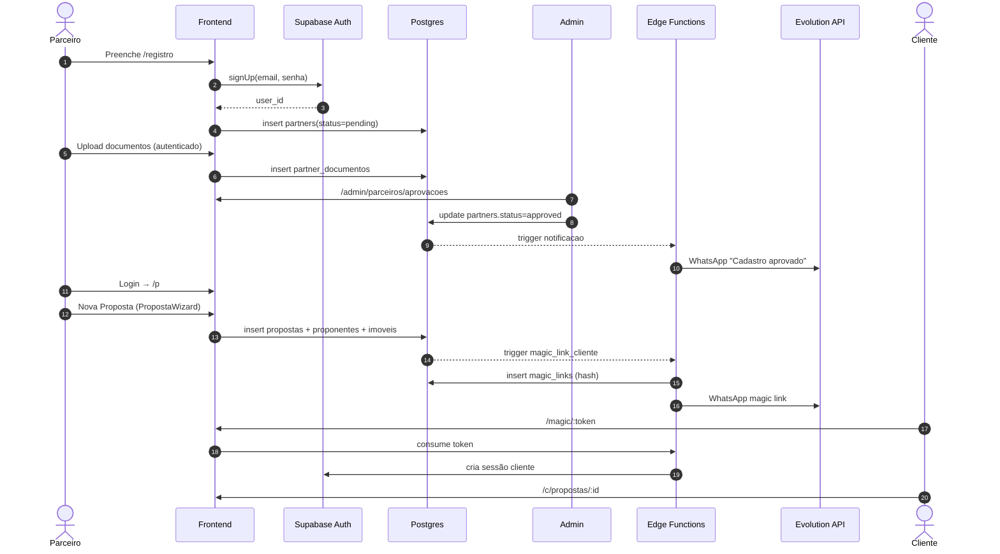
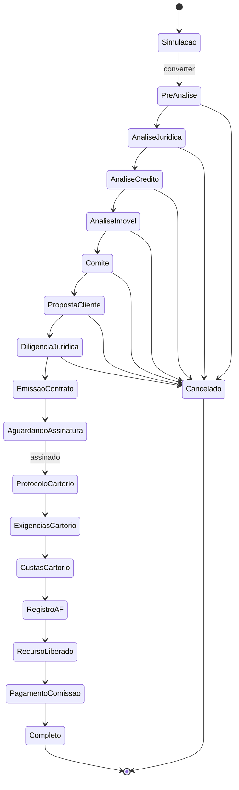
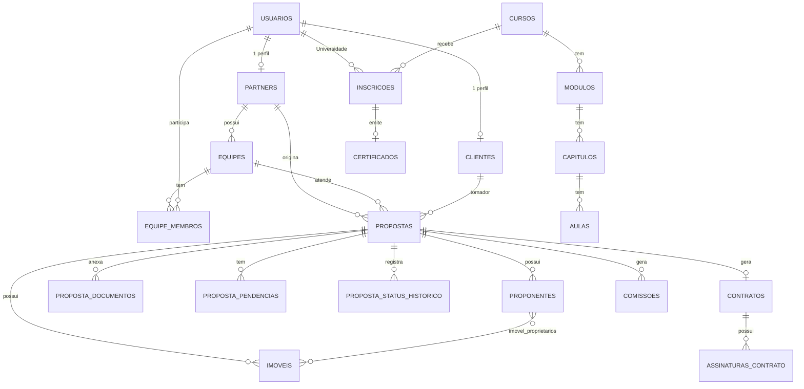
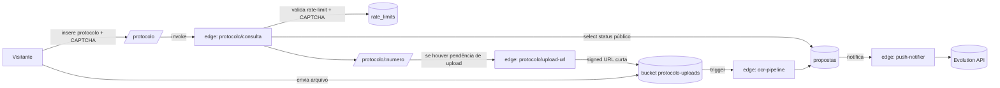
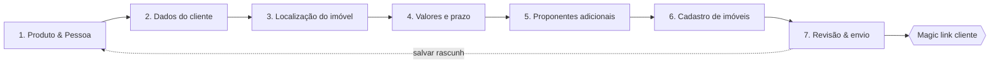
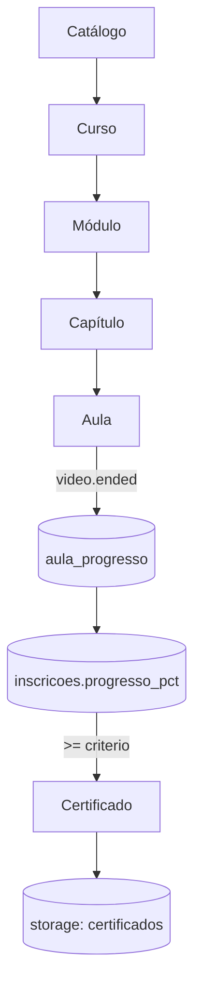
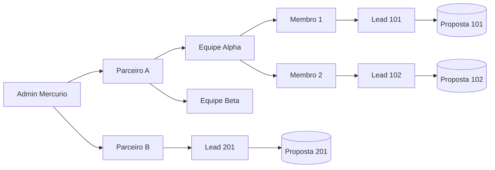
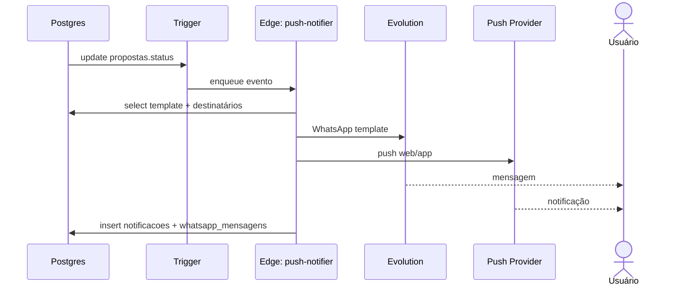

# 05 — Mapa Visual da Aplicação

Diagramas em Mermaid (renderizam direto no GitHub/VS Code).

## 1. Sitemap por perfil

```mermaid
flowchart TB
  subgraph Public["🌐 Público"]
    P0[/"/ Landing"/]
    P1[/p/login/]
    P1a["/login (alias)"]
    P2[/registro/]
    P3[/recuperar-senha/]
    P4[/protocolo/]
    P5[/magic/:token/]
  end

  subgraph Client["👤 Cliente"]
    C0[/c Início/]
    C1[/c/propostas/]
    C2[/c/propostas/:id/]
    C3[/c/propostas/:id/documentos/]
    C4[/c/perfil/]
    C5[/c/notificacoes/]
    C6[/c/universidade/]
  end

  subgraph Partner["🤝 Parceiro / Assistente"]
    PA0[/p Início/]
    PA1[/p/dashboard/]
    PA2[/p/simulacoes/]
    PA3[/p/propostas/]
    PA4[/p/propostas/nova/]
    PA5[/p/propostas/:id/]
    PA6[/p/equipe/]
    PA7[/p/relatorios/]
    PA8[/p/universidade/]
    PA9[/p/configuracoes/]
  end

  subgraph Admin["🛡 Admin"]
    A0[/admin Dashboard/]
    A1[/admin/parceiros/]
    A2[/admin/clientes/]
    A3[/admin/propostas/]
    A4[/admin/rede ReactFlow/]
    A5[/admin/documentos/]
    A6[/admin/financeiro/]
    A7[/admin/universidade/]
    A8[/admin/fluxos/]
    A9[/admin/campanhas/]
    A10[/admin/integracoes/]
    A11[/admin/auditoria/]
  end

  P1a --> P1
  P1 --> C0
  P1 --> PA0
  P1 --> A0
  P5 --> C0
  P5 --> PA0
  PA3 --> PA5
  PA5 --> PA3
  A3 --> A4
```

`/p/simulacoes` é uma ferramenta local: parâmetros → cálculo Price/SAC → card exportável/`wa.me` → draft de sessão → `/p/propostas/nova`. Nenhum envio transacional ou linha de banco é criado antes da conclusão do wizard.

## 2. Jornada do parceiro (registro → originação)

## 3. Esteira da proposta (status flow)

Contradição resolvida: o fluxo antigo terminava em `contrato_registrado`/`recurso_liberado`. Esses valores permanecem legados; o alvo inclui cartório, comissão e terminal positivo `completo`.

## 4. ER simplificado (núcleo)

## 5. Fluxo: consulta pública por protocolo

## 6. Wizard de criação de proposta (UX)

## 7. Universidade (LMS)

## 8. React Flow — Rede de Originação (admin)

## 9. Push & WhatsApp (notificação de status)

